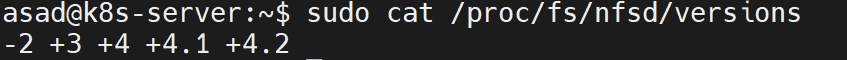
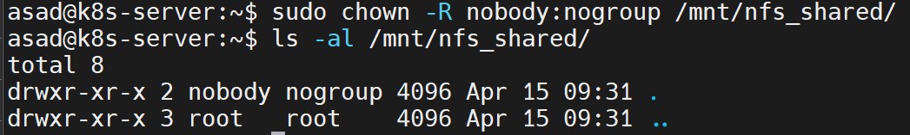
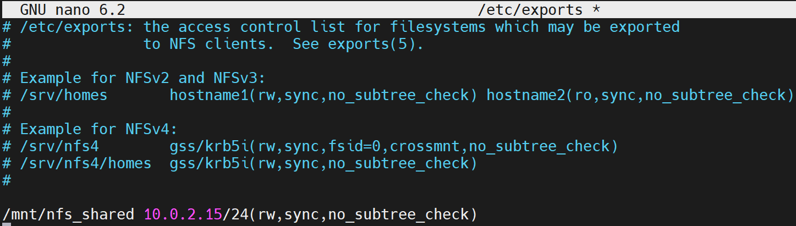
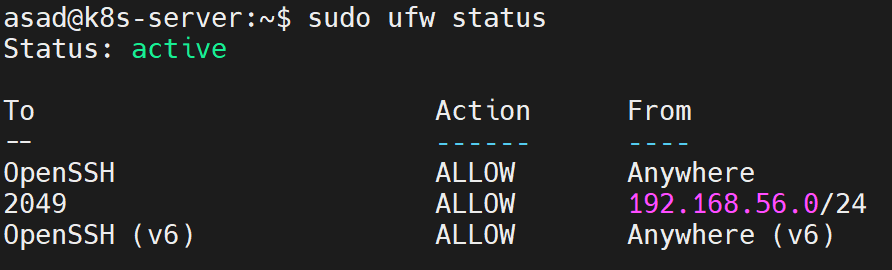

# NFS Persistence for Odoo Application 
In this demo project we are going to deploy an Odoo application along with Postgres database, on Kubernetes. To persist the data of application and database we'll be using provisioning storage from NFS with the help of PVC. 

## Step 1: Setup NFS Server 
Network File System (NFS) is a distributed file system protocol that allows us to mount remote directories on machines over a network. This lets us manage storage space in a different location and write to that space from multiple clients. NFS provides a relatively standard and performant way to access remote systems over a network and works well in situations where the shared resources must be accessed regularly.

### Step 1 (A): Installing the NFS Server 
The NFS server package provides user-space support needed to run the NFS kernel server. To install the package, run following commands:

`sudo apt update`

`sudo apt install nfs-kernel-server`

Once the installation is completed, the NFS services will start automatically.

We can verify the versions of NFS by running the following cat command:

`sudo cat /proc/fs/nfsd/versions`

### Step 1 (B): Make shared NFS directory
We will create a directory named **nfs_shared** that is going to be shared by all client systems. To do so, run the following command:

`sudo mkdir -p /mnt/nfs_shared`

### Step 1 (C): Set directory permissions
Set the permissions of the created **nfs_shared** directory so that all client machines can easily access it:

`sudo chown -R nobody:nogroup /mnt/nfs_shared/`

### Step 1 (D): Set file permissions
Set the file permissions as required. In our case, we have allocated the read, write, and execute permissions to the **nfs_shared** directory files:

`sudo chmod 777 /mnt/nfs_shared/`

### Step 1 (E): Grant NFS access
In this step, we will grant access to the client system for accessing the NFS server. To do so, open **/etc/exports** in the **nano** editor:

`sudo nano /etc/exports`

Now, it is up to us whether we want to grant access to the entire **subnet**, **single** or **multiple** clients. For instance, we will permit can entire subnet **10.0.2.15/24** to access the NFS shared:

Following statement is used to grant access to a subnet. 

`/mnt/nfs_share 10.0.2.15/24(rw,sync,no_subtree_check)`

### Step 1 (F): Exporting NFS directory
Following command is used to export the NFS shared directory:

`sudo exportfs -a`

### Step 1 (G): Restart NFS server
Now restart the NFS server using following command: 

`sudo systemctl restart nfs-kernel-server`

### Step 1 (H): RestartGrant Firewall access
It is time to grant the Firewall access to the client system with the following **ufw** command:

`sudo ufw allow from 10.0.2.15/24 to any port nfs`

### Step 1 (I): Enable Firewall
Enable Firewall with **ufw** command and **enable** option:

`sudo ufw enable`

