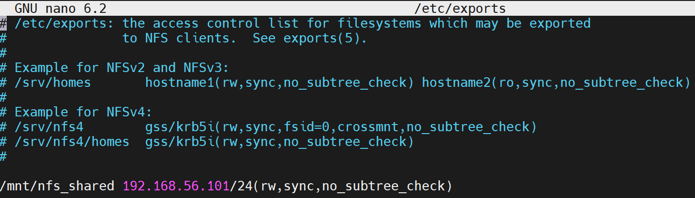

# NFS Persistence for Odoo Application 
In this demo project we are going to deploy an Odoo application along with Postgres database, on Kubernetes. To persist the data of application and database we'll be using provisioning storage from NFS with the help of PVC. 

## Step 1: Setup NFS Server 
Network File System (NFS) is a distributed file system protocol that allows us to mount remote directories on machines over a network. This lets us manage storage space in a different location and write to that space from multiple clients. NFS provides a relatively standard and performant way to access remote systems over a network and works well in situations where the shared resources must be accessed regularly.

### Step 1 (A): Installing the NFS Server 
The NFS server package provides user-space support needed to run the NFS kernel server. To install the package, run following commands:

`sudo apt update`

`sudo apt install nfs-kernel-server`

Once the installation is completed, the NFS services will start automatically.

We can verify the versions of NFS by running the following cat command:

`sudo cat /proc/fs/nfsd/versions`


### Step 1 (B): Make shared NFS directory
We will create a directory named **nfs_shared** that is going to be shared by all client systems. To do so, run the following command:

`sudo mkdir -p /mnt/nfs_shared`

### Step 1 (C): Set directory permissions
Set the permissions of the created **nfs_shared** directory so that all client machines can easily access it:

`sudo chown -R nobody:nogroup /mnt/nfs_shared/`


### Step 1 (D): Set file permissions
Set the file permissions as required. In our case, we have allocated the read, write, and execute permissions to the **nfs_shared** directory files:

`sudo chmod 777 /mnt/nfs_shared/`

### Step 1 (E): Grant NFS access
In this step, we will grant access to the client system for accessing the NFS server. To do so, open **/etc/exports** in the **nano** editor:

`sudo nano /etc/exports`

Now, it is up to us whether we want to grant access to the entire **subnet**, **single** or **multiple** clients. For instance, we will permit can entire subnet **192.168.56.101/24** to access the NFS shared:

Following statement is used to grant access to a subnet. 

`/mnt/nfs_share 192.168.56.101/24(rw,sync,no_subtree_check)`



### Step 1 (F): Exporting NFS directory
Following command is used to export the NFS shared directory:

`sudo exportfs -a`

### Step 1 (G): Restart NFS server
Now restart the NFS server using following command: 

`sudo systemctl restart nfs-kernel-server`

### Step 1 (H): RestartGrant Firewall access
It is time to grant the Firewall access to the client system with the following **ufw** command:

`sudo ufw allow from 192.168.56.101/24 to any port nfs`

### Step 1 (I): Enable Firewall
Enable Firewall with **ufw** command and **enable** option:

`sudo ufw enable`

Status of the `ufw` firewall can be seen in following screenshot. 


## Step 2: NFS Client Configuration 
Now we need to configure our NFS client so that it can access the shared directory of NFS Server. 

In our case we want to access the directory on our **Minikube** environment. So for our case Minikube is the client. 

### Step 2 (A): SSH into Minikube
Minikube provides a nice command to SSH into it. To SSH into our Minikube instance use: `minikube ssh` command.


### Step 2 (B): Verify Communication between Minikube and NFS Server
It is a good idea to verify the Minikube VM can communicate with the NFS server host. Use ping to verify communication by using the IP address of the Linux host that is hosting the NFS server, i.g. `192.168.56.102` . Limit the ping command to 2 with `-c 2` so it will stop pinging.

`ping 192.168.56.102 -c 2`


As we can see from the figure, our minikube can communicate sucessfully with the NFS server. 

### Step 2 (C): Mount in Minikube as the NFS client
Previous step has ensured that the client and server can communicate, lets set up the NFS client in Minikube.

Create a **mount** in Minikube as the NFS client. Kubernetes will handle mapping the directories and mounts for your containers and volumeMounts.

Create an NFS mount using following command:

`mount -t nfs 192.168.56.102:/mnt/nfs_shared /mnt`

The mount command needs the source that is the NFS server IP address, i.e. `192.168.56.102` and absolute path to the shared directory, i.e. `/mnt/nfs_shared`. And this will mount in `/mnt` in Minikube so the Pods will have access.

## Step 3: Create a StorageClass NFS provisioning  
Folllowing stoage class contents will be used to provision the storage automatically. 

File Name: **nfs-storage-class.yaml**. 

```
apiVersion: storage.k8s.io/v1
kind: StorageClass
metadata:
  name: nfs-storage
provisioner: k8s.io/minikube-hostpath
parameters:
  server: 192.168.56.102
  path: /mnt/nfs_shared
reclaimPolicy: Delete
volumeBindingMode: Immediate
mountOptions: 
  - hard
  - nfsvers=4.1
```

Apply this storage class using following command.

`kubectl apply -f nfs-storage-class.yaml`

See the storage class using following command.

`kubectl get sc`


## Step 4: Create PersistentVolumeClaims (PVCs) for Postgres and Odoo 
Since we are going to deploy Odoo application alongwith its database. To persist the data for postgres and odoo we need to create PVCs for **Postgres** and **Odoo**. 

### Step 4 (A): Create a PersistentVolumeClaim (PVC) for Postgres 

File name: **postgresql-pvc.yaml**

```
apiVersion: v1
kind: PersistentVolumeClaim
metadata:
  name: postgresql-pvc
spec:
  storageClassName: nfs-storage
  accessModes:
    - ReadWriteMany
  resources:
    requests:
      storage: 1Gi
```

Apply this PVC using following command.

`kubectl apply -f postgresql-pvc.yaml`

See the PVC using following command.

`kubectl get pvc`


### Step 4 (B): Create a PersistentVolumeClaim (PVC) for Odoo 

File name: **odoo-pvc.yaml**

```
apiVersion: v1
kind: PersistentVolumeClaim
metadata:
  name: odoo-pvc
spec:
  storageClassName: nfs-storage
  accessModes:
    - ReadWriteMany
  resources:
    requests:
      storage: 1Gi
```

Apply this PVC using following command.

`kubectl apply -f odoo-pvc.yaml`

See the PVC using following command.

`kubectl get pvc`


## Step 5: Other K8s Manifest files
To deploy the Oddo and Postgres we also need to create various manifest files, as listed below:
- ConfigMap
- Secret 
- Deployments (for `Odoo` and `Postgres`)
- Services (for `Odoo` and `Postgres`)

### Step 5 (A): Create ConfigMap and Secret 
Following **ConfigMap** is being used.

```
apiVersion: v1
kind: ConfigMap
metadata:
  name: app-configmap
data:
  database_url: postgres-service
  database_username: admin
```

Following **Secret** is being used.

```
apiVersion: v1
kind: Secret
metadata:
  name: app-secret
type: Opaque
data:
  database_password: LW4gInJvb3QiIA0K
```

Apply the ConfigMap and Secret using following commands.

`kubectl apply -f app-configmap.yaml`

`kubectl apply -f app-secret.yaml`


### Step 5 (B): Postgres Deployment and Service 
In this section we are going to define **deployment** and **service** for Postgre database. 

Create a file **postgress.yaml**. 
```
apiVersion: apps/v1
kind: Deployment
metadata:
  name: postgres-deployment
spec:
  replicas: 1
  selector:
    matchLabels:
      app: postgres
  template:
    metadata:
      labels:
        app: postgres
    spec:
      containers:
        - name: postgres
          image: postgres:10.1 
          ports:
            - containerPort: 5432 
          env:
            - name: POSTGRES_DB
              valueFrom:
                configMapKeyRef: 
                  name: app-configmap
                  key: database_url
            - name: POSTGRES_USER
              valueFrom:
                configMapKeyRef: 
                  name: app-configmap
                  key: database_username
            - name: POSTGRES_PASSWORD
              valueFrom:
                secretKeyRef: 
                  name: app-secret
                  key: database_password
          volumeMounts:
            - mountPath: /var/lib/postgresql/data
              name: postgredb
      volumes:
        - name: postgredb
          persistentVolumeClaim:
            claimName: postgresql-pvc
---
apiVersion: v1
kind: Service
metadata:
  name: postgres-service
  labels:
    app: postgres 
spec:
  selector:
    app: postgres
  type: LoadBalancer 
  ports:
    - port: 5432 
```

Apply the Deployment and Service using following command.

`kubectl apply -f postgres.yaml`


### Step 5 (C): Odoo Deployment and Service 
Let's define **deployment** and **service** for Oddo app. 

Create a file **odoo-app.yaml**. 

```
apiVersion: apps/v1
kind: Deployment
metadata:
  name: odoo-deployment
  labels:
    app: odoo
spec:
  replicas: 1
  selector:
    matchLabels:
      app: odoo
  template:
    metadata:
      labels:
        app: odoo
    spec:
      containers:
      - name: odoo
        image: odoo:14.0
        ports:
        - containerPort: 8069
        env:
        - name: HOST
          valueFrom:
            configMapKeyRef: 
              name: app-configmap
              key: database_url
        - name: USER
          valueFrom:
            configMapKeyRef: 
              name: app-configmap
              key: database_username
        - name: PASSWORD
          valueFrom:
            secretKeyRef: 
              name: app-secret
              key: database_password
        volumeMounts:
          - mountPath: /var/lib/odoo
            name: odoo-data
      volumes:
        - name: odoo-data
          persistentVolumeClaim:
            claimName: odoo-pvc
---
apiVersion: v1
kind: Service
metadata:    
  name: odoo-service
spec:
  type: LoadBalancer
  selector:
    app: odoo
  ports:
    - protocol: TCP
      port: 8069
      targetPort: 8069
```

Apply the Deployment and Service using following command.

`kubectl apply -f odoo-app.yaml`

